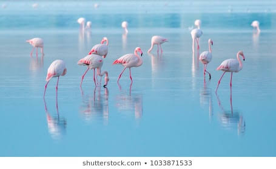

<html>
 <head> 
  <link rel="styledsheet" type="text/css" href="stylesheet.css">
 </head> 
 <body> 
  
 
   
Birds
 
  
 
  
 
    <ul>
      <li><a href="">Home</a></li>
        <li><a href="">News</a></li>
          <li><a href="">About</a></li>
            <li><a href="">Contact us</a></li>
      </ul>
  
 
  
 
   <h2><u>Types of birds</u></h2> 
   
Peacock
 
   
Pigeon
 
   
Parrot
 
   
Dudo
 
  
 
  
 
   <h1>Peacock</h1> 
   
Peafowl is a common name for three species of birds in the genera Pavo and Afropavo of the Phasianidae family, the pheasants and their allies. Male peafowl are referred to as peacocks, and female peafowl as peahens, though peafowl of either sex are often referred to colloquially as peacocks.
 
  
 
  
 
    
  
 
  
 
   <h1>Pigeon</h1> 
   
 Columbidae is a bird family containing the pigeons and doves. It is the only family in the order Columbiformes. These are stout-bodied birds with short necks, and short slender bills that in some species feature fleshy ceres. They primarily feed on seeds, fruits, and plants. 
 
  
 
  
 
   <h1>Parrot&gt;</h1> 
   
 Parrots, also known as psittacines, are birds of the roughly 393 species in 92 genera comprising the order Psittaciformes, found mostly in tropical and subtropical regions. The order is subdivided into three superfamilies: the Psittacoidea, the Cacatuoidea, and the Strigopoidea.
 
  
 
    

      &copy;All Rights Reserved
      

 </body>
</html>
